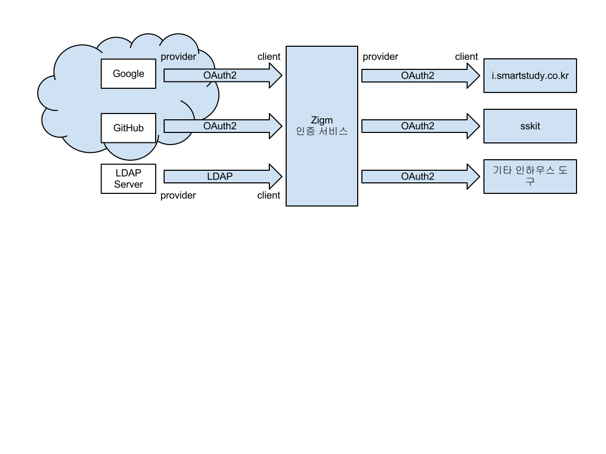

인증 서비스
===========

개요
----

관련 API
--------

* :http:get:`/users/(user)`

.. http:get:: /groups/(group_name)

   그룹의 정보와 그룹에 속한 사용자의 목록을 불러옵니다.

   :statuscode 200: 정상 요청

       ====== ===
       키     값
       ====== ===
       id     unique, 변경 불가
       uid    URI에 쓸 수 있는 형태의 그룹 이름. unique, 변경 가능
       name   그룹 이름, 변경 가능
       users  그룹에 소속된 사용자의 URI 목록
       ====== ===

   :statuscode 404: 해당 이름의 그룹이 없음
